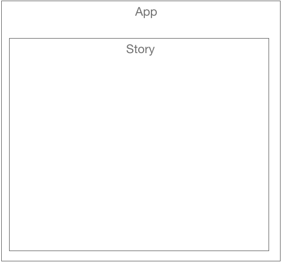

<h4 align="center">
 
█ █▀▄▀█ █▀█ █▀█ █▀ ▀█▀ █▀▀ █▀█
█ █░▀░█ █▀▀ █▄█ ▄█ ░█░ ██▄ █▀▄
</h4>

<br>
<div align="center">

</div>


<h2 align = 'center'>A React website by David Sterry </h2>
<p align = 'center'>
Initialized on 02/26/21
Last updated on 03/10/21
</p>

## 🌐 Description
A scrollable linear story that follows a character as they learn to deal with imposter syndrome. Built in React and utilizing the react-spring parallax scrolling effect each section has it's own images and background that emphasize the emotional content of that section. The story culminates with the character learning to accept and move past their imposter syndrome

## 📖 **User Stories**
This story will appeal to anyone who has struggled with Imposter syndrome. 

## **MVP**
* Parallax Scrolling story, with different "sections" for parts of the story
* Different images and backgrounds for each story parallax "section"
* Parallax effect used to emphasize certain emotional content
* Return to start from end of page, so user doesn't have to scroll backward

## 🙆 **Stretch Goals**
* Landing page with prompt to start story
* Animations at story transitions 
* Animated background for some pages
* Animations triggered by clicks
* More fleshed out story


## 🔧 Setup & Requirements
### 📋 Necessary Specifications
 * An internet browser of your choice. I prefer Chrome
 * A code editor of your choice. I use VSCode downloaded it [here](https://code.visualstudio.com/)
 *  **Node.js :** You can check if you have Node.js by running `node -v` in the command line. If you do not have Node.js please find more information and download [here](https://nodejs.org/en/)
 * you can also install node through Homebrew by running `brew install node` in the command line.


## **How to get this project** 

### Download from Github:
1. Use the browser navigate to my GitHub page [respository](https://github.com/Dave-Sterry/Imposter)
2. Click the Green **Code** button and select **Download Zip**

### Alternatively clone from Github via Gitbash:
1. In your terminal, navigate to the folder where you would like to clone the project too
2. Clone this repo to your chosen folder using "git clone https://github.com/Dave-Sterry/Imposter in terminal

### 🧰  Setup Options

1. Open the project in your code editor of choice 
2. In the Terminal navigate to the project folder in this case Imposter
3. Run ```npm install``` to install required dependencies 
4. Run ```npm start``` This will run the app in the development mode.
5. Open [http://localhost:3000](http://localhost:3000) to view it in the browser.

### 👀 View Project Live 
1. See the project live [here!](https://dave-sterry.github.io/Imposter/)

### ❓ How to use the site. 
Scroll to the left and read the story. 


### 📑 Project Planning Documentation 



### 📸 Photo Credits
Photo by <a href="https://unsplash.com/@markusspiske?utm_source=unsplash&utm_medium=referral&utm_content=creditCopyText">Markus Spiske</a> on <a href="/collections/4651415/coding?utm_source=unsplash&utm_medium=referral&utm_content=creditCopyText">Unsplash</a> Code Image

 <a href="http://www.freepik.com">Designed by Creativetoons / Freepik</a> Person asleep at desk

<a href="http://www.freepik.com">Designed by pch.vector / Freepik</a> Clouds
  
Photo by <a href="https://unsplash.com/@chrislawton?utm_source=unsplash&utm_medium=referral&utm_content=creditCopyText">Chris Lawton</a> on <a href="/t/nature?utm_source=unsplash&utm_medium=referral&utm_content=creditCopyText">Unsplash</a>Trees background image


Photo by <a href="https://unsplash.com/@markusspiske?utm_source=unsplash&utm_medium=referral&utm_content=creditCopyText">Markus Spiske</a> on <a href="/s/photos/thumbs-down?utm_source=unsplash&utm_medium=referral&utm_content=creditCopyText">Unsplash</a> thumbs down image
  

This project was bootstrapped with [Create React App](https://github.com/facebook/create-react-app).

## 🪲 Known Bugs
Doesn't scale properly when screen size gets smaller


## 🛠️ Technologies Used

## MVP
* React Framework v17.0
* Javascript ES6
* JSX
* Git & GitHub
* Babel
* ESLint
* CSS
* HMTL
* VSCode
* created using ```create-react-app```
* react-spring 

## Stretch Goals Tools
* Tone.js
* anime.js
* React-spring


## 📫 Contributors
| Author | Github | Email |
|--------|--------|-------|
| David Sterry | [https://github.com/Dave-Sterry] | [sterry.david@gmail.com]  

## ✉️ Contact and Support
If you any feedback or questions, please contact me 
  
  
## 📘 License

```This project is licensed under **MIT 2.0**
Permission is hereby granted, free of charge, to any person obtaining a copy
of this software and associated documentation files (the "Software"), to deal
in the Software without restriction, including without limitation the rights
to use, copy, modify, merge, publish, distribute, sublicense, and/or sell
copies of the Software, and to permit persons to whom the Software is
furnished to do so, subject to the following conditions:

The above copyright notice and this permission notice shall be included in all
copies or substantial portions of the Software.

THE SOFTWARE IS PROVIDED "AS IS", WITHOUT WARRANTY OF ANY KIND, EXPRESS OR
IMPLIED, INCLUDING BUT NOT LIMITED TO THE WARRANTIES OF MERCHANTABILITY,
FITNESS FOR A PARTICULAR PURPOSE AND NONINFRINGEMENT. IN NO EVENT SHALL THE
AUTHORS OR COPYRIGHT HOLDERS BE LIABLE FOR ANY CLAIM, DAMAGES OR OTHER
LIABILITY, WHETHER IN AN ACTION OF CONTRACT, TORT OR OTHERWISE, ARISING FROM,
OUT OF OR IN CONNECTION WITH THE SOFTWARE OR THE USE OR OTHER DEALINGS IN THE
SOFTWARE.```

Copyright © 2020 David Sterry

